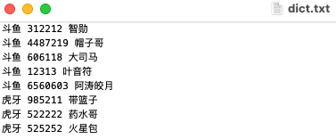

# WatchLive_cross-platform
## 特点

优雅地看直播

- 跨直播平台

- 无广告
- 高清流畅
- 没有礼物特效
- 无需注册账号

## 如何使用

```shell
git clone https://github.com/panlianghnu/WatchLive_cross-platform.git
cd WatchLive_cross-platform/
```

### 1、安装依赖

```shell
pip install
```

### 2、修改订阅

按照 “平台” “房间号” “标注” 的格式，每一行代表一个直播间，行内元素用空格分开

如图:



### 3、修改播放器

第 59 行，修改 open_app 的值，改成自己的支持流媒体输出的视频播放器的路径，比如你是 IINA 播放器，就写 open_app = "open -a /Applications/IINA.app"

如果不是 MacOS ，可能命令不是 open -a，需要自己修改

### 4、运行

在当前目录直接运行 python main.py 即可啦

可以像我一样在桌面放置一个 shell 文件，修改路径为自己的 shell 和 main.py

```shell
#! /bin/zsh
## author:panliang
python ~/real-url/main.py
```

本工具仅在 python3 的环境测试

获取斗鱼的直播源，需 JavaScript 环境，可使用 node.js

## 特别感谢

[real-url](https://github.com/wbt5/real-url) 提供获取直播间源播放地址的方法

